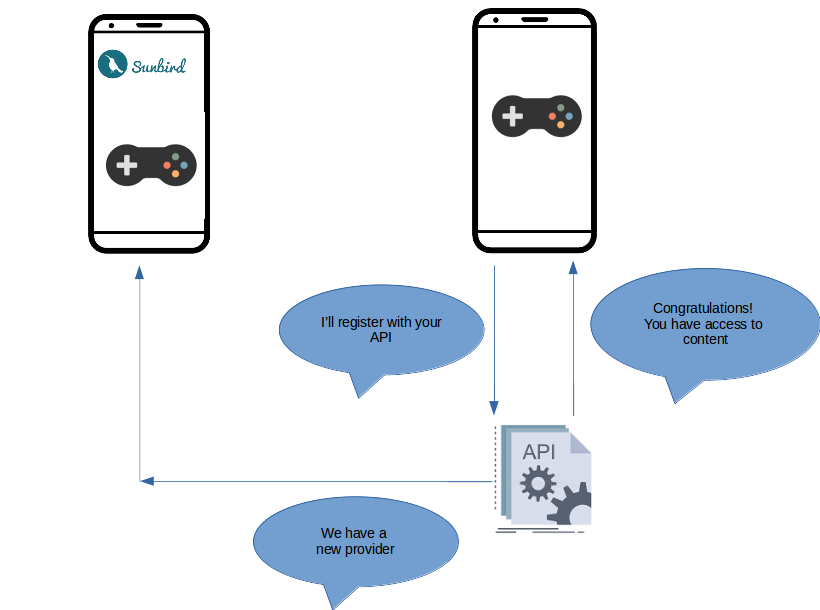
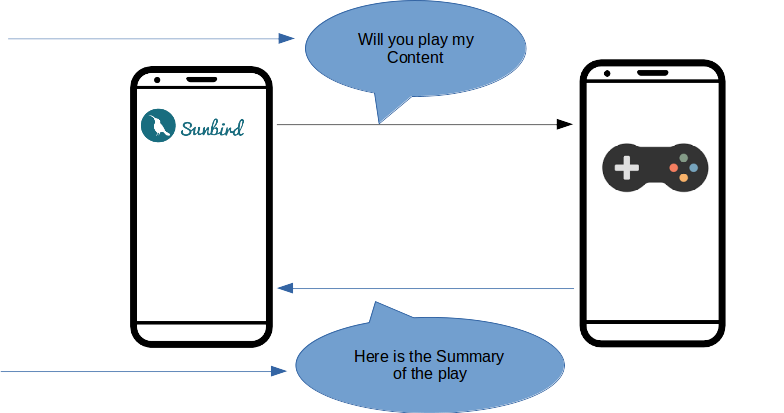

# SOFIE
Specification for Open Feature Integration and Extensions

Documentation is categorised into multiple sections:
* WorkFlow
* Registration of Apps to Sunbird
    * Global Registration API
* Technical Specification for third party apps
    * Param Data Supported
    * Intent Handling
* Content Model Specification
* Summary Event Specification    


## Overview
Intent of this specification is to integrate with external apps for feature extension
 (OR) feature integration of Sunbird Application.





### Sunbird Third Party App Interaction



```{referrerPackageId:"com.sunbird.readAlongApp",referenceID:"App generated Code",mimeType:"",vendorCode:"",contentUrl:"",profileContext:"{handle:'',avatar:''}"}```


## Registration Spec for Apps to Sunbird
Each Third Party App can be registered as part of Global Configuration for Sunbird to have app links being enabled.

```
{
  identifier: "",
  name: "",
  logo: "",
  appName: "",
  packageId: "",
  target: {
    mimeType: [
      
    ],
    contentType: [
      
    ],
    ....//Allcontentattributes
  },
  appDetails: {
    organization: ""
  }
}
```

## Technical Specification for third party apps
### Param Data Supported
<details>
<summary>Expand Param Data</summary>

| Params | Description | Data Type|
| -- | -- | -- |
| referrerPackageId | Package details of referrer app | String |
| referenceID | Reference ID to be sent back to sunbird app | String |
| mimeType | Content MimeType | String |
| authKey | Authorization Key for referrer app | String |
| contentUrl | Url of the content | String |
| profileContext | Name and Avatar in JSONified String | String |
</details>
### Intent Handling

* Need to create an intent filter in Android Manifest as follows 
```xml
<activity
    android:name="com.example.ExampleActivity"
    android:label="@string/title_example" >
    <intent-filter android:label="@string/play_view_web_example">
        <action android:name="android.intent.action.VIEW" />
        <category android:name="android.intent.category.DEFAULT" />
        <category android:name="android.intent.category.BROWSABLE" />
        <!-- Accepts URIs that begin with "http://sunbird.staginged.in/play” -->
        <data android:scheme="https"
              android:host="sunbird.staginged.in"
              android:pathPrefix="/play" />
    </intent-filter>
    <intent-filter android:label="@string/play_view_app_example">
        <action android:name="android.intent.action.VIEW" />
        <category android:name="android.intent.category.DEFAULT" />
        <category android:name="android.intent.category.BROWSABLE" />
        <!-- Accepts URIs that begin with "example://play” -->
        <data android:scheme="example"
              android:host="play" />
    </intent-filter>
</activity>
```
* Implement Activity as follows
```
@Override
public void onCreate(Bundle savedInstanceState) {
    super.onCreate(savedInstanceState);
    setContentView(R.layout.main);

    Intent intent = getIntent();
    String action = intent.getAction();
    Uri data = intent.getData();
    <!-- Trigger the Business Logic of App -->
}
```

### Content Model Specification
<details>
<summary>Expand API Documentation</summary>
The third party apps should do a HTTP GET call on the contentUrl parameter sent via the intent data.

```
GET intentdata.contentUrl

Headers {
  X-App-ID: <ID of the App>,
  X-App-Version: <Version of the App>,
  X-Device-ID: <Device Id>
}
```

```
{
  "id":"api.content.read",
  "ver":"v1",
  "ts":"2021-02-10 04:27:14:674+0000",
  "params":{
    "resmsgid":null,
    "msgid":"90e184d1-c52c-106b-c410-6a168900ef05",
    "err":null,
    "status":"success",
    "errmsg":null
  },
  "responseCode":"OK",
  "result": {
    "content": ContentModel
  }
}
```
For More Details on the content model refer Sunbird Documentation.
* content - https://github.com/sunbird-specs/LearningObjectModel/blob/main/v1/schemas/content/1.0/schema.json
* collection - https://github.com/sunbird-specs/LearningObjectModel/blob/main/v1/schemas/collection/1.0/schema.json
</details>

### Summary Event Specification
<details>
<summary>Expand Summary Event</summary>
https://github.com/sunbird-specs/Telemetry/blob/main/v3_event_details.md/#summary

```
{
  "edata": {
    "type": "", // Required. Type of summary. Free text. "session", "app", "tool" etc
    "mode": "", // Optional.
    "starttime": Long, // Required. Epoch Timestamp of app start. Retrieved from first event.
    "endtime": Long, // Required. Epoch Timestamp of app end. Retrieved from last event.
    "timespent": Double, // Required. Total time spent by visitor on app in seconds excluding idle time.
    "pageviews": Long, // Required. Total page views per session(count of CP_IMPRESSION)
    "interactions": Long, // Required. Count of interact events
    "envsummary": [{ // Optional
        "env": String, // High level env within the app (content, domain, resources, community)
        "timespent": Double, // Time spent per env
        "visits": Long // count of times the environment has been visited
    }],
    "eventssummary": [{ // Optional
        "id": String, // event id such as CE_START, CE_END, CP_INTERACT etc.
        "count": Long // Count of events.
    }],
    "pagesummary": [{ // Optional
        "id": String, // Page id
        "type": String, // type of page - view/edit
        "env": String, // env of page
        "timespent": Double, // Time taken per page
        "visits": Long // Number of times each page was visited
    }]
  }
}
```
</details>


